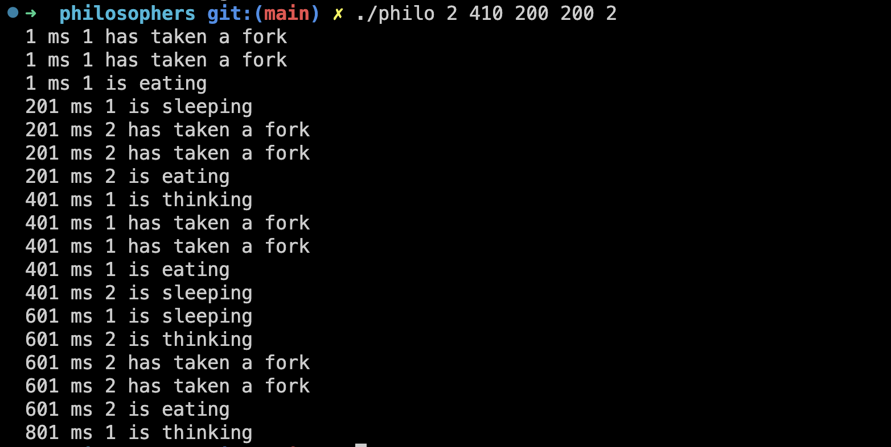

# Philosophers Dining Table

## Description
This project simulates the classic problem of the philosophers dining table, where a group of philosophers are sitting around a table and are trying to eat. The problem is that there are only a limited number of forks available, and each philosopher needs two forks to eat. This project is implemented in C and uses pthreads to create a concurrent solution to the problem.


## Requirements
- C compiler (gcc, etc...)
- Make

## Cloning, compiling and running
Clone the repository to your local machine

```git clone``` ```https://github.com/Mouad-El-Asri/philosophers.git```

To compile the program, navigate to the project directory and run the following command :

```Make```

To run the program, use the following command line arguments :

```./philo``` ```[number_of_philosophers]``` ```[time_to_die]``` ```[time_to_eat]``` ```[time_to_sleep]``` ```[number_of_times_each_philosopher_must_eat]```

## Parameters
The program takes in four mandatory command line arguments and one optional argument, which are the number of philosophers at the table, time to sleep, time to eat and time to sleep. Beside number of times each philosopher must eat wchich is the optional command line argument.

## Example
```./philo``` ```5``` ```800``` ```200``` ```200``` ```7```

This command is running the "philo" program with 5 philosopher threads, 800 milliseconds for the time to die, 200 milliseconds for the time to eat, 200 milliseconds for the time to sleep, and 7 as an argument for the number of times each philosopher should eat before the simulation stops.

## Screenshot



## Note
The program will run indefinitely until a philosopherdies, or the simulation stops because each philosopher has reached number of times he must eat, or manually stopped by the user.

## Additional resources
- [Dining Philosophers Problem](https://en.wikipedia.org/wiki/Dining_philosophers_problem)
- [Unix Threads in C](https://www.youtube.com/watch?v=d9s_d28yJq0&list=PLfqABt5AS4FmuQf70psXrsMLEDQXNkLq2)
